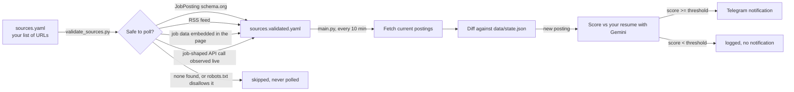

# pantau-loker

[](LICENSE)
[](https://www.python.org/)
[](https://github.com/features/actions)

A self-hosted assistant that watches the job boards and career pages you
choose, 24/7, and pings you on Telegram the moment a new posting matches your
resume — so you can apply while it's still fresh, without refreshing tabs all
day.

You decide which sites to watch, you decide what counts as a match, and you
decide whether to apply. pantau-loker only removes the busywork in between.

## Why

Job hunting for remote roles usually means keeping a dozen tabs open and
refreshing them by hand, hoping to catch a posting before hundreds of other
applicants do. pantau-loker automates that watch loop: it polls your chosen
sources on a schedule, scores every new posting against your resume with an
LLM, and only notifies you when the score clears your bar.

It's designed to be run by anyone, not just engineers. Fork it, drop in your
own credentials, list the companies you're targeting, and it runs entirely on
GitHub's free infrastructure.

## How it works



Nothing is polled until it has passed validation. That two-step design means
you always know exactly which sites are active, and the tool can't be pointed
at arbitrary endpoints without a check in between.

## Features

- **No hardcoded companies or platforms.** Every source is a URL you provide
  at runtime. There is no built-in list of "supported" companies anywhere in
  the code — the same checks run against whatever you paste in, and each one
  is verified live rather than assumed from a name or domain.
- **Nothing scraped, nothing bypassed.** A source is only accepted if it's
  public, machine-readable data the site already exposes on purpose:
  `JobPosting` schema.org markup, an RSS feed, structured data embedded in
  the page's own initial load, or a plain API call the page's own frontend
  makes (verified live in a headless browser). `robots.txt` gates every one
  of these before it's ever added to your watch list, and no hidden or
  undocumented endpoint is ever guessed at blindly. A page that renders its
  listings as plain HTML with no structured data anywhere is correctly
  reported as unsupported rather than scraped.
- **Any resume format.** A hosted PDF/DOCX link, or a PDF/DOCX file you drop
  into the repo yourself — whichever is less friction for you.
- **Runs for free.** GitHub Actions on a public repo has no minute limit for
  a workflow like this one.
- **Your data stays yours.** Resume, bot token, and API keys live only in
  your fork's GitHub Secrets. Nothing sensitive ever touches this codebase.

## Quick start

### 1. Fork this repository

### 2. Gather three things

| What | Where to get it |
|---|---|
| A Telegram bot token + chat ID | Message [@BotFather](https://t.me/BotFather), run `/newbot`, then message your new bot once and open `https://api.telegram.org/bot<TOKEN>/getUpdates` to read your chat ID |
| A Gemini API key (free tier) | [Google AI Studio](https://aistudio.google.com/app/apikey) |
| Your resume | A link to a hosted PDF/DOCX, or the file itself |

### 3. Add your resume

Two options, depending on how you're running pantau-loker:

- **Running the scheduled cloud workflow (recommended, 24/7):** set the
  `CV_URL` secret (below) to a direct link to your resume (PDF or DOCX),
  hosted anywhere reachable from the internet. GitHub Actions runs on GitHub's
  servers, so it can't see a file on your computer — it needs a URL.
- **Running locally on your own machine:** drop a `.pdf` or `.docx` file into
  the [`cv/`](cv) folder instead. That folder is git-ignored by default, so
  the file never leaves your machine.

Do not force-commit a resume into `cv/` to make the cloud workflow use it —
this repository is public, and doing so would publish your resume to anyone
on the internet.

### 4. Add your secrets

In your fork: **Settings → Secrets and variables → Actions → New repository
secret**.

| Secret | Value |
|---|---|
| `CV_URL` | Link to your resume file (skip if you uploaded to `cv/` instead) |
| `TELEGRAM_BOT_TOKEN` | From BotFather |
| `TELEGRAM_CHAT_ID` | Your chat ID |
| `GEMINI_API_KEY` | From Google AI Studio |

### 5. Test your setup

**Actions → Test Setup → Run workflow.** This checks your resume, Gemini key,
and Telegram bot in one go, and sends a test message to your chat if
everything's working. Fix anything it flags before moving on.

### 6. List the sites you want watched

Two ways to add URLs — no need to know what powers any of them:

- **Without editing any file:** **Actions → Validate Sources → Run workflow**,
  paste one or more URLs into the "New URLs to add" box (comma-separated),
  and run it. The workflow adds them to `sources.yaml` and validates them in
  the same run.
- **By editing the file directly:** open [`sources.yaml`](sources.yaml) and
  add one URL per line. The file also ships with a few already-verified
  example sites, commented out — just uncomment the ones you want.

### 7. Validate

Pushing a change to `sources.yaml` automatically runs validation, and using
the "New URLs to add" box above runs it immediately. Either way, each URL is
checked and the ones that pass are written to `sources.validated.yaml`, with
a log line explaining why anything else was skipped.

### 8. Enable monitoring

**Actions → Monitor Jobs.** Once enabled, this runs on a 10-minute schedule
against whatever is in `sources.validated.yaml`, and messages you on Telegram
for every match above your threshold.

## Configuration reference

**`config.yaml`**

```yaml
threshold: 80               # minimum match score (0-100) that triggers a notification
validation:
  max_sources: 50            # cap on URLs checked per validation run
  request_delay_seconds: 1.5 # delay between requests while validating
```

**`sources.yaml`** — a flat list under `urls:`. No other structure required.

## How source validation decides what's safe

Given a raw URL, four checks are tried in order, stopping at the first one
that returns real postings:

1. **`JobPosting` structured data** — schema.org markup embedded directly in
   the page for search engines (Google for Jobs).
2. **RSS feed autodiscovery** — checked via the page's own `<link>` tag, or a
   handful of common feed paths.
3. **Embedded page data** — many modern career pages (Next.js, Remix, and
   similar frameworks) render server-side and ship their job list as a JSON
   blob inside the page's own `<script>` tags rather than a separate API
   call. A plain HTTP request already contains this — no browser needed.
4. **Live API observation** — as a last resort, the page is opened in a
   headless browser and the real network calls it makes while loading are
   inspected. If one of them returns job-shaped JSON, that exact request
   (method, URL, and body) is recorded and replayed directly on every future
   poll — no browser needed after validation.

At every step, a candidate is only accepted if the response actually looks
like job data (title, location, company, etc. — checked via a generic
heuristic, not a per-site assumption) and `robots.txt` allows the exact
request. Undocumented or unofficial API endpoints are never guessed at
blindly — steps 3 and 4 only ever reuse a request the page already made to
render itself, never a path invented by pantau-loker. A page whose listings
are plain, unstructured HTML with no structured data anywhere (some older
career pages) is correctly reported as unsupported rather than scraped.

## Advanced: manual source overrides

Some sites genuinely can't be validated automatically — for example, a page
whose own frontend never calls its platform's official public API directly,
so there's no live request to observe and adopt. If you've personally
confirmed such an API exists, is public, requires no login, and is allowed
by the site's `robots.txt`, you can add it directly to
[`sources.manual.yaml`](sources.manual.yaml). Entries there are merged into
`sources.validated.yaml` on every validation run, unchanged and unvalidated
— you're vouching for them yourself. See the comments in that file for the
entry format.

This is an escape hatch for cases you've personally verified, not a way to
add scraping or guessed endpoints — nothing here is checked automatically,
so the responsibility for confirming it's safe and public is yours.

## Project layout

```
sources.yaml              your input: URLs to watch (auto-validated)
sources.manual.yaml       your input: hand-verified overrides (never auto-validated)
sources.validated.yaml    generated: what's actually being polled
config.yaml               threshold and validation limits
cv/                       drop a local resume file here (git-ignored)
data/state.json           tracks which postings have already been seen
src/
  job.py                  the Job data model shared across the codebase
  http_utils.py           shared HTTP helpers (User-Agent, robots.txt)
  detector.py             the four-strategy source validation logic
  fetcher.py              fetches and normalizes postings from a validated source
  cv_loader.py            reads a resume from a URL or an uploaded PDF/DOCX file
  matcher.py              scores a posting against the resume via Gemini
  notifier.py             sends the Telegram message
  state.py                reads and writes data/state.json
  add_sources.py          appends URLs to sources.yaml from the workflow's input box
  validate_sources.py     entry point for the Validate Sources workflow
  main.py                 entry point for the Monitor Jobs workflow
  test_setup.py           entry point for the Test Setup workflow
```

## Running locally

```bash
python -m venv .venv && source .venv/bin/activate
pip install -r requirements.txt
playwright install chromium   # one-time, needed only for validation
cp .env.example .env          # fill in your own credentials

python src/validate_sources.py
python src/main.py
```

## Security notes

- Every source is validated against public, machine-readable data the site
  published on purpose, or a request the page's own frontend genuinely makes
  — never a bypassed login, and never an endpoint invented or guessed by
  pantau-loker itself.
- `robots.txt` is checked before any new source is accepted, including a
  live API call discovered via the headless-browser step — if the site asks
  bots to stay off that path, it's skipped even if the call works.
- Validation runs are capped (`config.yaml → validation.max_sources`) so the
  tool can't be turned into a way to hammer a long list of servers at once.
- The scheduled workflow commits `data/state.json` on every run purely to
  keep the repository active — GitHub disables scheduled workflows on repos
  with no commits for 60 days.
- This repository never stores anyone's personal data. Resumes, tokens, and
  API keys live only in each fork's own GitHub Secrets.

## Contributing

Issues and PRs are welcome.

## Disclaimer

This project only surfaces information that's already public. It doesn't
apply to jobs on your behalf, and it isn't affiliated with any job board,
ATS, or company it can be configured to watch.

## License

[MIT](LICENSE)
