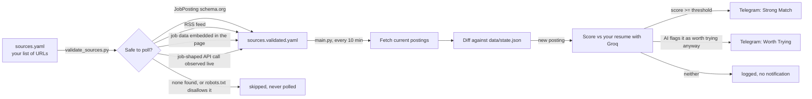

# pantau-loker

[](LICENSE)
[](https://www.python.org/)
[](https://github.com/features/actions)
[](#project-status)

A self-hosted assistant that watches the job boards and career pages you
choose, 24/7, and pings you on Telegram the moment a new posting matches your
resume — so you can apply while it's still fresh, without refreshing tabs all
day.

You decide which sites to watch, you decide what counts as a match, and you
decide whether to apply. pantau-loker only removes the busywork in between.

## Project status

Early and actively evolving — expect rough edges. To be clear about what
this is and isn't:

- It does **not** apply to jobs for you. It only notifies you; the decision
  and the click are always yours.
- It does **not** monitor "every job site." Only sites that expose public,
  machine-readable data can be detected safely (see [How source validation
  decides what's safe](#how-source-validation-decides-whats-safe)) — many
  well-known job boards don't qualify, and that list is unlikely to ever be
  "every site."
- Configuration, defaults, and even the AI provider have already changed
  once during early use (see [CHANGELOG.md](CHANGELOG.md)) as real-world
  limits were discovered. More of that is likely as this keeps developing.

Feedback and issues are genuinely useful at this stage — see
[Contributing](#contributing).

## Table of contents

- [Why](#why)
- [How it works](#how-it-works)
- [Features](#features)
- [Quick start](#quick-start)
- [Configuration reference](#configuration-reference)
- [How source validation decides what's safe](#how-source-validation-decides-whats-safe)
- [Advanced: manual source overrides](#advanced-manual-source-overrides)
- [Project layout](#project-layout)
- [Running locally](#running-locally)
- [Troubleshooting](#troubleshooting)
- [Security notes](#security-notes)
- [Contributing](#contributing)
- [Disclaimer](#disclaimer)
- [License](#license)

## Why

Job hunting for remote roles usually means keeping a dozen tabs open and
refreshing them by hand, hoping to catch a posting before hundreds of other
applicants do. pantau-loker automates that watch loop: it polls your chosen
sources on a schedule, scores every new posting against your resume with an
LLM, and only notifies you when the score clears your bar.

It's designed to be run by anyone, not just engineers. Fork it, drop in your
own credentials, list the companies you're targeting, and it runs entirely on
GitHub's free infrastructure.

## How it works



Nothing is polled until it has passed validation. That two-step design means
you always know exactly which sites are active, and the tool can't be pointed
at arbitrary endpoints without a check in between.

## Features

- **No hardcoded companies or platforms.** Every source is a URL you provide
  at runtime. There is no built-in list of "supported" companies anywhere in
  the code — the same checks run against whatever you paste in, and each one
  is verified live rather than assumed from a name or domain.
- **Nothing scraped, nothing bypassed.** A source is only accepted if it's
  public, machine-readable data the site already exposes on purpose:
  `JobPosting` schema.org markup, an RSS feed, structured data embedded in
  the page's own initial load, or a plain API call the page's own frontend
  makes (verified live in a headless browser). `robots.txt` gates every one
  of these before it's ever added to your watch list, and no hidden or
  undocumented endpoint is ever guessed at blindly. A page that renders its
  listings as plain HTML with no structured data anywhere is correctly
  reported as unsupported rather than scraped.
- **Understands adjacent skills, not just keywords.** Matching is done by an
  LLM, not string matching — a resume listing React.js is recognized as
  relevant to a Next.js posting, for example, because it reasons about the
  relationship rather than requiring an exact keyword hit.
- **Two-tier notifications.** A posting at or above `threshold` is sent as a
  "Strong Match." One below it can still be sent as "Worth Trying" if the AI
  finds a specific reason it's a reasonable stretch (closely related skills,
  a learnable gap) — it's deliberately selective about this, not a second
  lower threshold applied to everything.
- **Any resume format.** A hosted PDF/DOCX link, or a PDF/DOCX file you drop
  into the repo yourself — whichever is less friction for you.
- **Runs for free.** GitHub Actions on a public repo has no minute limit for
  a workflow like this one.
- **Your data stays yours.** Resume, bot token, and API keys live only in
  your fork's GitHub Secrets. Nothing sensitive ever touches this codebase.

## Quick start

### 1. Fork this repository

### 2. Gather three things

| What | Where to get it |
|---|---|
| A Telegram bot token + chat ID | Message [@BotFather](https://t.me/BotFather), run `/newbot`, then message your new bot once and open `https://api.telegram.org/bot<TOKEN>/getUpdates` to read your chat ID |
| A Groq API key (free tier) | [console.groq.com/keys](https://console.groq.com/keys) |
| Your resume | A link to a hosted PDF/DOCX, or the file itself |

### 3. Add your resume

Two options, depending on how you're running pantau-loker:

- **Running the scheduled cloud workflow (recommended, 24/7):** set the
  `CV_URL` secret (below) to a direct link to your resume (PDF or DOCX),
  hosted anywhere reachable from the internet. GitHub Actions runs on GitHub's
  servers, so it can't see a file on your computer — it needs a URL.
- **Running locally on your own machine:** drop a `.pdf` or `.docx` file into
  the [`cv/`](cv) folder instead. That folder is git-ignored by default, so
  the file never leaves your machine.

Do not force-commit a resume into `cv/` to make the cloud workflow use it —
this repository is public, and doing so would publish your resume to anyone
on the internet.

### 4. Add your secrets

In your fork: **Settings → Secrets and variables → Actions → New repository
secret**.

| Secret | Value |
|---|---|
| `CV_URL` | Link to your resume file (skip if you uploaded to `cv/` instead) |
| `TELEGRAM_BOT_TOKEN` | From BotFather |
| `TELEGRAM_CHAT_ID` | Your chat ID |
| `GROQ_API_KEY` | From console.groq.com |

### 5. Test your setup

**Actions → Test Setup → Run workflow.** This checks your resume, Groq key,
and Telegram bot in one go, and sends a test message to your chat if
everything's working. Fix anything it flags before moving on.

### 6. List the sites you want watched

Two ways to add URLs — no need to know what powers any of them:

- **Without editing any file:** **Actions → Validate Sources → Run workflow**,
  paste one or more URLs into the "New URLs to add" box (comma-separated),
  and run it. The workflow adds them to `sources.yaml` and validates them in
  the same run.
- **By editing the file directly:** open [`sources.yaml`](sources.yaml) and
  add one URL per line. The file also ships with a few already-verified
  example sites, commented out — just uncomment the ones you want.

### 7. Validate

Pushing a change to `sources.yaml` automatically runs validation, and using
the "New URLs to add" box above runs it immediately. Either way, each URL is
checked and the ones that pass are written to `sources.validated.yaml`, with
a log line explaining why anything else was skipped.

### 8. Enable monitoring

**Actions → Monitor Jobs.** Once enabled, this runs on a 10-minute schedule
against whatever is in `sources.validated.yaml`, and messages you on Telegram
for every match above your threshold.

## Configuration reference

**`config.yaml`**

```yaml
threshold: 80                  # minimum match score (0-100) for a "strong match" notification
matching:
  requests_per_minute: 20      # stay under your Groq plan's rate limit (see console.groq.com/settings/limits)
  max_per_run: 40              # cap on jobs scored per run; the rest are picked up in later runs
  max_per_day: 200             # hard daily cap on the *number* of AI matches
  max_tokens_per_day: 180000   # hard daily cap on *tokens* used — usually the real bottleneck, see note below
validation:
  max_sources: 50              # hard cap on total entries allowed in sources.yaml
  request_delay_seconds: 1.5   # delay between requests while validating
```

If you have a lot of sources or a large initial backlog, jobs beyond any of
these caps are simply scored in a later run rather than all at once —
nothing is skipped or lost, it just takes a while to catch up the first time.
Lower these if you're on a more limited plan, or raise them if you have more
headroom.

**A request-count cap alone is not enough.** Most providers, including
Groq's free tier, also cap *tokens per day* independently of *requests per
day* — and for some models the token cap is the one you'll actually hit
first, since each match sends your resume and the job description as input.
`max_tokens_per_day` tracks real token usage (from the API's own response)
and stops before your provider starts rejecting requests outright, rather
than discovering the limit through a wall of `429` errors.

**`sources.yaml`** — a flat list under `urls:`. No other structure required.

## How source validation decides what's safe

Given a raw URL, four checks are tried in order, stopping at the first one
that returns real postings:

1. **`JobPosting` structured data** — schema.org markup embedded directly in
   the page for search engines (Google for Jobs).
2. **RSS feed autodiscovery** — checked via the page's own `<link>` tag, or a
   handful of common feed paths.
3. **Embedded page data** — many modern career pages (Next.js, Remix, and
   similar frameworks) render server-side and ship their job list as a JSON
   blob inside the page's own `<script>` tags rather than a separate API
   call. A plain HTTP request already contains this — no browser needed.
4. **Live API observation** — as a last resort, the page is opened in a
   headless browser and the real network calls it makes while loading are
   inspected. If one of them returns job-shaped JSON, that exact request
   (method, URL, and body) is recorded and replayed directly on every future
   poll — no browser needed after validation.

At every step, a candidate is only accepted if the response actually looks
like job data (title, location, company, etc. — checked via a generic
heuristic, not a per-site assumption) and `robots.txt` allows the exact
request. Undocumented or unofficial API endpoints are never guessed at
blindly — steps 3 and 4 only ever reuse a request the page already made to
render itself, never a path invented by pantau-loker. A page whose listings
are plain, unstructured HTML with no structured data anywhere (some older
career pages) is correctly reported as unsupported rather than scraped.

## Advanced: manual source overrides

Some sites genuinely can't be validated automatically — for example, a page
whose own frontend never calls its platform's official public API directly,
so there's no live request to observe and adopt. If you've personally
confirmed such an API exists, is public, requires no login, and is allowed
by the site's `robots.txt`, you can add it directly to
[`sources.manual.yaml`](sources.manual.yaml). Entries there are merged into
`sources.validated.yaml` on every validation run, unchanged and unvalidated
— you're vouching for them yourself. See the comments in that file for the
entry format.

This is an escape hatch for cases you've personally verified, not a way to
add scraping or guessed endpoints — nothing here is checked automatically,
so the responsibility for confirming it's safe and public is yours.

## Project layout

```
sources.yaml              your input: URLs to watch (auto-validated)
sources.manual.yaml       your input: hand-verified overrides (never auto-validated)
sources.validated.yaml    generated: what's actually being polled
config.yaml               threshold and validation limits
cv/                       drop a local resume file here (git-ignored)
data/state.json           tracks which postings have already been seen
src/
  job.py                  the Job data model shared across the codebase
  http_utils.py           shared HTTP helpers (User-Agent, robots.txt)
  detector.py             the four-strategy source validation logic
  fetcher.py              fetches and normalizes postings from a validated source
  cv_loader.py            reads a resume from a URL or an uploaded PDF/DOCX file
  matcher.py              scores a posting against the resume via Groq
  notifier.py             sends the Telegram message
  state.py                reads and writes data/state.json
  add_sources.py          appends URLs to sources.yaml from the workflow's input box
  validate_sources.py     entry point for the Validate Sources workflow
  main.py                 entry point for the Monitor Jobs workflow
  test_setup.py           entry point for the Test Setup workflow
```

## Running locally

```bash
python -m venv .venv && source .venv/bin/activate
pip install -r requirements.txt
playwright install chromium   # one-time, needed only for validation
cp .env.example .env          # fill in your own credentials

python src/validate_sources.py
python src/main.py
```

## Troubleshooting

**A URL passes `curl`/a browser fine but Validate Sources skips it.**
The four detection strategies only accept public, machine-readable data
(`JobPosting` schema, RSS, embedded JSON, or a live API call the page's own
frontend makes) — a site that renders listings as plain HTML with nothing
else is correctly unsupported, not a bug. See [How source validation decides
what's safe](#how-source-validation-decides-whats-safe). If you believe the
site actually exposes something detectable, open a **Source can't be
detected** issue with what you found.

**Zero notifications, even though jobs are being fetched.**
Check the run's log for the score line per job (`- <title> @ <company>:
NN%`). Low scores across the board usually just mean those particular
postings genuinely don't match your resume — not a bug. If scores never
appear at all, check the AI provider step for errors instead.

**`429 Too Many Requests` / `RESOURCE_EXHAUSTED` from your AI provider.**
An occasional one is expected under load and gets retried automatically. A
long run of them near the end of a run usually means you've hit a **tokens
per day** limit, not a requests-per-day one — the error message will say
`tokens per day (TPD)` explicitly. Lower `matching.max_tokens_per_day` in
`config.yaml` to match what your provider's dashboard actually shows for
your model (check console.groq.com/settings/limits), not just the
request-count limits.

**A model name suddenly stops working (`model not found` / `deprecated`).**
AI providers rename and retire models over time. Set `GROQ_MODEL` (as a
secret or in `.env`) to a model currently listed in your provider's console
rather than waiting for a code update.

**The scheduled `Monitor Jobs` workflow just stopped running.**
GitHub disables scheduled workflows on repos with no commits for 60 days.
The workflow commits `data/state.json` on every run specifically to prevent
this, but if the repo has been otherwise idle for a long time, re-enable the
workflow manually from the Actions tab.

**I pushed a change and now `git pull` complains about a conflict in
`sources.validated.yaml` or `data/state.json`.**
Both files are rewritten by the scheduled workflows. It's safe to discard
your local copy and take the remote one: `git checkout --theirs
sources.validated.yaml data/state.json` (or `git checkout -- <file>` after a
plain `git pull` failure), then continue.

## Security notes

- Every source is validated against public, machine-readable data the site
  published on purpose, or a request the page's own frontend genuinely makes
  — never a bypassed login, and never an endpoint invented or guessed by
  pantau-loker itself.
- `robots.txt` is checked before any new source is accepted, including a
  live API call discovered via the headless-browser step — if the site asks
  bots to stay off that path, it's skipped even if the call works.
- `sources.yaml` itself is capped at `config.yaml → validation.max_sources`
  entries — including when adding URLs through the "New URLs to add" workflow
  input, which silently drops anything past the limit rather than growing the
  file without bound. This keeps a careless or malicious mass-paste (hundreds
  or thousands of URLs at once) from turning the tool into a way to hammer a
  long list of servers, and keeps validation runs bounded in time.
- The scheduled workflow commits `data/state.json` on every run purely to
  keep the repository active — GitHub disables scheduled workflows on repos
  with no commits for 60 days.
- This repository never stores anyone's personal data. Resumes, tokens, and
  API keys live only in each fork's own GitHub Secrets.
- Every network call that fetches external content (RSS included) goes
  through a request with a bounded timeout — nothing can hang a run
  indefinitely waiting on a slow or unresponsive server.
- Every workflow job has a `timeout-minutes` ceiling as a last-resort safety
  net, so an unexpected hang gets killed automatically instead of running
  for hours.
- New URLs (whether added by editing `sources.yaml` or through the "New
  URLs to add" workflow input) are checked against a strict `http(s)://`
  pattern before being written to the file, so a malformed or crafted entry
  can't corrupt the file's structure.
- The Telegram bot token is never included in error messages or logs, even
  when a request to Telegram fails.

## Contributing

Issues and PRs are welcome — see [CONTRIBUTING.md](CONTRIBUTING.md) for how
to report bugs, suggest a source that should be detectable, and the code
style this project follows. Participation is governed by the [Code of
Conduct](CODE_OF_CONDUCT.md).

Found a security issue? See [SECURITY.md](SECURITY.md) instead of opening a
public issue.

## Disclaimer

This project only surfaces information that's already public. It doesn't
apply to jobs on your behalf, and it isn't affiliated with any job board,
ATS, or company it can be configured to watch.

## License

[MIT](LICENSE)
